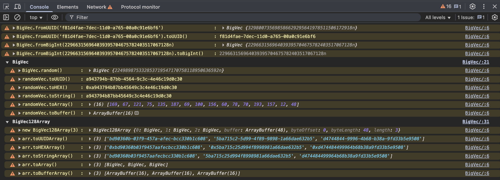

# 🌌 BigVec: A 128-bit Scalar Primitive for a New Era of JavaScript 🌌

<p align="center">
  
  
  
</p>

In the vast universe of JavaScript, we have numbers, strings, and even `BigInt`. But what if you could hold the power of a 128-bit vector in a single, elegant, scalar value? What if you could manipulate UUIDs, hashes, and other large numbers with the grace of a primitive?

**✨ Behold, `BigVec`. ✨**

`BigVec` is not just a library; it's a paradigm shift. It's a novel data type that brings the power of 128-bit vectors to your fingertips, wrapped in a beautiful, intuitive API. It's the bridge between the high-level world of JavaScript objects and the raw, untamed power of binary data.

## 🎨 The Vision: The Art of Intelligence 🎨

`BigVec` is a testament to the "Art of Intelligence." It's a creation born from a deep understanding of JavaScript's soul, a desire to push the boundaries of what's possible. It's a symphony of `BigInt`'s flexibility and `ArrayBuffer`'s raw power.

We didn't just want to create another utility. We wanted to forge a new primitive. And while `BigVec` may not be a true primitive in the eyes of the JavaScript engine, it dances like one in your code. It's a scalar value, a single entity, that you can pass, compare, and command with effortless grace.

## 🚀 Features 🚀

*   **Scalar 128-bit Values:** Command 128-bit vectors as if they were single, atomic numbers. 🌌
*   **UUIDs as First-Class Citizens:** Create, manipulate, and convert UUIDs with unparalleled ease. 🆔
*   **Seamless Conversion:** Effortlessly morph `BigVec` between `BigInt`, `String`, `ArrayBuffer`, and more. 🔄
*   **Typed Arrays:** Wield `BigVec128Array` to command legions of `BigVec`s with a familiar, powerful API. ⚔️
*   **Performance:** `BigVec128Array` is forged from a single `ArrayBuffer` for ultimate memory efficiency. ⚡️
*   **Debugger's Dream:** A custom `{{Debugger}}` hook provides a rich, explorable universe within your `BigVec` data. 🔍

## 🎬 Show, Don't Tell: The Examples 🎬

### Creating `BigVec`s

```javascript
import { BigVec } from "./index.js";

// From a UUID
const fromUUID = BigVec.fromUUID("f81d4fae-7dec-11d0-a765-00a0c91e6bf6");

// From a BigInt
const fromBigInt = BigVec.fromBigInt(123456789n);

// From a hex string
const fromString = BigVec.fromString("0x1234567890abcdef1234567890abcdef");

// A random BigVec
const random = BigVec.random();

console.log("From UUID:", fromUUID.toUUID());
console.log("From BigInt:", fromBigInt.toHEX());
console.log("From String:", fromString.toString());
console.log("Random:", random.toUUID());
```

### The `{{Debugger}}` Property

When you inspect a `BigVec` in your browser's developer console, you'll be greeted with a beautifully organized object that gives you a complete view of your data.

```javascript
const myVec = BigVec.random();
console.log(myVec);
```

 <!-- You can replace this with an actual image -->

### `BigVec128Array` in Action

```javascript
import { BigVec, BigVec128Array } from "./index.js";

// Create an array of 5 random BigVecs
const arr = BigVec128Array.random(5);

// Map to a new array of UUIDs
const uuids = arr.map(vec => vec.toUUID());
console.log("UUIDs:", uuids);

// Sort the array
const sorted = arr.sort((a, b) => a.toBigInt() - b.toBigInt());
console.log("Sorted HEX:", sorted.toHEXArray());

// Filter the array
const filtered = arr.filter(vec => vec.toBigInt() > BigInt("0x80000000000000000000000000000000"));
console.log("Filtered:", filtered.toHEXArray());
```

## 🔮 The Magic Revealed 🔮

You might be wondering, "How does this sorcery work?" The secret lies in a beautiful, elegant hack.

`BigVec` masterfully leverages JavaScript's `BigInt` to cradle its 128-bit soul. When a `BigVec` is born, we're actually creating a `BigInt` object and then bestowing upon it the prototype of `BigVec.prototype`. This act of creation gives us the power to imbue the `BigInt` with our own methods, effectively forging a new primitive type.

The true magic, the sleight of hand, is revealed when you invoke `toString(16)` on a `BigVec`. Because our `BigVec` is a `BigInt` in disguise, we can summon `BigInt.prototype.toString.call(this, 16)` to conjure a 32-character hex string, a perfect representation of the 128-bit value. This is the key that unlocks the gates to UUIDs, hashes, and a universe of 128-bit data formats.

## 🛠️ API Reference 🛠️

### `BigVec`

*   `BigVec.from(value)`: Creates a `BigVec` from a variety of sources.
*   `BigVec.fromUUID(uuid)`: Creates a `BigVec` from a UUID string.
*   `BigVec.fromString(hexString)`: Creates a `BigVec` from a hex string.
*   `BigVec.fromBigInt(bigInt)`: Creates a `BigVec` from a `BigInt`.
*   `BigVec.random()`: Creates a random `BigVec`.
*   `vec.toUUID()`: Converts a `BigVec` to a UUID string.
*   `vec.toHEX()`: Converts a `BigVec` to a hex string.
*   `vec.toString()`: Converts a `BigVec` to a 32-character hex string.
*   `vec.toBigInt()`: Converts a `BigVec` to a `BigInt`.
*   `vec.toArray()`: Converts a `BigVec` to an array of bytes.
*   `vec.toBuffer()`: Converts a `BigVec` to an `ArrayBuffer`.

### `BigVec128Array`

*   `new BigVec128Array(length)`: Creates a new `BigVec128Array` of the given length.
*   `BigVec128Array.random(length)`: Creates a new `BigVec128Array` with random values.
*   `arr.set(array)`: Sets the values of the array.
*   `arr.at(index)`: Gets the `BigVec` at the given index.
*   `arr.map(callback)`: Maps the array to a new `BigVec128Array`.
*   `arr.filter(callback)`: Filters the array.
*   `arr.sort(callback)`: Sorts the array.
*   And many more of your favorite array methods!

## 💖 A New Primitive for a New Era 💖

`BigVec` is more than a library; it's a love letter to JavaScript. It's a tool for building the next generation of applications, from high-performance databases to decentralized identity systems.

We invite you to join us on this odyssey. Explore the code, dance with the examples, and let your imagination soar. The future of data in JavaScript is here, and its name is `BigVec`.

## 📜 License 📜

This project is licensed under the MIT License - see the [LICENSE](LICENSE) file for details.
